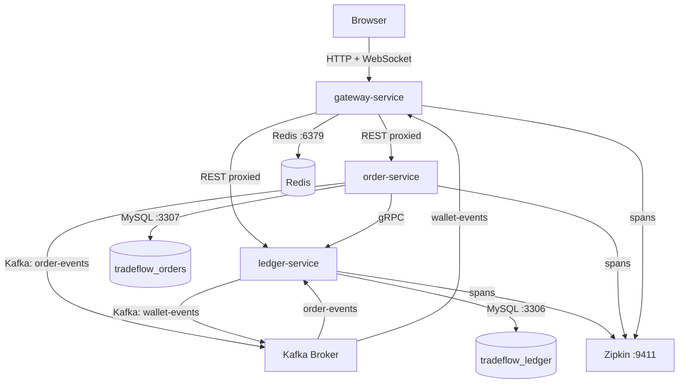

# TradeFlow

A distributed e-commerce and financial settlement engine built on Java 21,
Spring Boot 3, gRPC, Kafka, and MySQL.

[](https://github.com/DominiK037/tradeflow/actions/workflows/ci.yml)
[](https://openjdk.org/projects/jdk/21/)
[](https://spring.io/projects/spring-boot)
[](LICENSE)

---

## What it is

TradeFlow is a multi-service backend system that handles the full lifecycle of an
e-commerce transaction — from order placement through fund reservation, double-entry
ledger settlement, and real-time wallet event streaming to connected clients.

The system is decomposed into three bounded contexts: a financial ledger that owns
all monetary state, an order service that manages the order lifecycle, and a reactive
API gateway that handles authentication, rate limiting, and WebSocket push. Services
communicate synchronously over gRPC (with Protobuf contracts), asynchronously over
Kafka, and are secured end-to-end with RSA-signed JWTs.

The project is built phase by phase. Every component is fully tested with
Testcontainers integration tests and documented before the next phase begins.

---

## Architecture



**Communication model:** synchronous over gRPC (HTTP/2 + Protobuf) for fund reservation
between order-service and ledger-service — a point-in-time financial check that must block
until complete. Asynchronous over Kafka for all event-driven flows — order confirmation,
wallet settlement, and WebSocket push.

**Data ownership:** strict. No service reads from another service's database schema.
ledger-service owns `tradeflow_ledger`. order-service owns `tradeflow_orders`.
gateway-service has no MySQL — it is a stateless routing layer backed by Redis.

---

## Service Stack

| Service | Stack |
|---|---|
| `ledger-service` | Spring MVC · Spring Data JPA · Flyway · gRPC server · Kafka consumer/producer · OAuth2 Resource Server |
| `order-service` | Spring MVC · Spring Data JPA · Flyway · gRPC client · Kafka producer · Transactional Outbox · Resilience4j |
| `gateway-service` | Spring WebFlux · Spring Cloud Gateway · Redis reactive · JWT issuance (RSA) · WebSocket · Kafka consumer |
| `tradeflow-proto` | Protobuf 3 · gRPC Java stubs · single source of truth for all inter-service contracts |

---

## Getting Started

**Prerequisites:** Java 21+, Maven 3.9+, Docker

```bash
git clone https://github.com/DominiK037/tradeflow.git
cd tradeflow
```

Start local infrastructure (MySQL ×2, Redis, Kafka KRaft, Zipkin):

```bash
docker-compose up -d
```

Build and test all modules:

```bash
mvn clean install                                              # compile + unit test + package
mvn verify                                                     # unit + integration + Jacoco 85% gate
```

Run a single service module:

```bash
mvn test -pl ledger-service                                    # unit tests only
mvn verify -pl ledger-service                                  # unit + integration + coverage gate
mvn test -pl ledger-service -Dtest=LedgerEngineTest           # single class
```

---

## Contributing

### Branch naming

```
feature/<task-id>-<slug>    →  merges into dev via squash merge
chore/<slug>                →  branches off dev, merges back to dev
fix/<slug>                  →  branches off dev, merges back to dev
dev                         →  integration branch — merges into main when phase is complete
main                        →  stable, protected, squash merge only
```

---

## License

MIT © [Rushikesh Khedkar](https://github.com/DominiK037)
